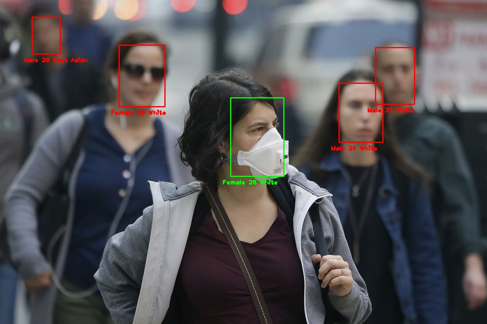
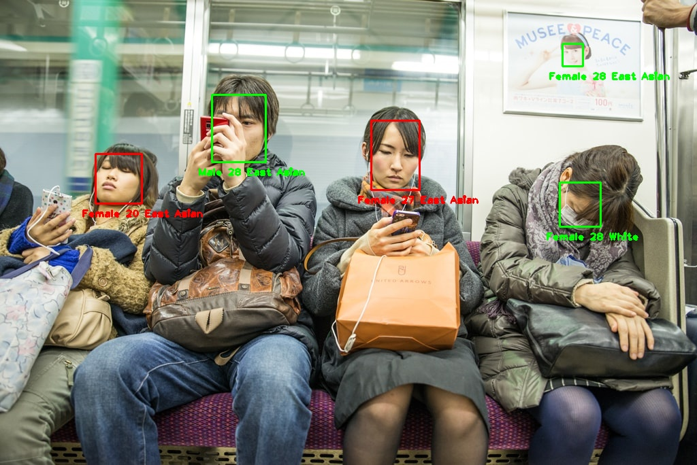

<h1 align="center">FaceScanner</h1>

<p align="center"> 
  
  
  
  
  
  
  
  
  
</p>
<br/>

## Objective
<p align="justify"> 
  <a>Implementation of multiples recent articles for detect age, gender, region, using or not using mask.</a>  
</p>
  

## Setup

<p align="justify"> 
 <a>Make sure after your git clone, create a folder called output. To do it, use:</a>
</p>

```shell
git clone https://github.com/victorkich/FaceScanner/
```

```shell
cd FaceScanner
```

```shell
mkdir output
```

<p align="justify"> 
 <a>All of requirements is show in the badgets above, but if you want to install all of them, enter the repository and execute the following line of code:</a>
</p>

```shell
pip3 install -r requirements.txt
```

<p align="justify"> 
 <a>For test in your image paste the file inside tests folder and put the following code:</a>
</p>

```shell
python3 predict.py --img your_img.type
```

<p align="justify"> 
 <a>The bouding box image and the log.csv will be appear inside the output folder.</a>
</p>

## Examples

<p align="center"> 
  
  
</p>  

## References
<p align="justify"> 
  This project uses a lot of already published articles, and you can see the references to the articles below:
  
  <a href="https://github.com/dchen236/FairFace">FairFace</a>
  
  <a href="https://github.com/biubug6/Pytorch_Retinaface">RetinaFace</a>
  
  <a href="https://github.com/chandrikadeb7/Face-Mask-Detection">Face-Mask-Detection</a>
</p>

<p align="center"> 
  <i>If you liked this repository, please don't forget to starred it!</i>
  
</p>
